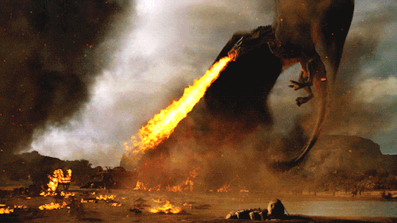

# Did the Winter really come to Westeros? Engineering the GoT CTF

# Introduction

This is supposed to be an abstraction to the technical preparation timeline of the CTF “Game Of Thrones”. The write-up will be a really objective (second-person) view (our honest confession) of our design, plans, choices, pros and cons, what we did well and didn’t throughout the process.

“Game of Thrones” - **a power struggle: who has it, who wants it and how they plan to get it.**

This is now your view as the Challenger of The Throne:

**In the perilous realm of Westeros, flags hold power as coveted as the Iron Throne itself. Dive into the intricate web of challenges, where every capture brings you closer to ruling the Seven Kingdoms. Beware, for in this game of flags, you win or you lose. Only the cunning and brave will seize the throne and reign supreme.**

This was the player’s challenge to overcome but what about the Throne, how is it choosing the Next Ruler? What are the sacrifices and risks the player needs to take while fighting their way through it? Let’s Build our Throne waiting for its Next Ruler to come!

### Deep Note

This is not a really Deep-Dive Engineering blog which intents to surprise the reader while solving a complex riddle of great technological problem.

It is just a Not-So-Technical blog of nerdy Non-Engineers Engineering their way to try to find answers to bunch of their dummy what-if questions.

Did we really overcome the Winter? What about White walkers? Will see it together!

# Challenges of Building a Throne

Our final goal was to implement a CTF environment to fulfill the following ideas:

- Not any kind of regulations by design - No rules will be conditioned to players, no ethics applied!
- The CTF machines will be Same-Machine-All-Players - Any challenge machine will have just one instance at the given time period and all players will have to find their way out through that same machine.
- As any player can have malicious intent (remember, no ethics applied!) inside machines, there will be no restriction. However, players can be caught by The City Watch(police) while or after committing a crime! So we needed to implement our version of “The City Watch”.

In summary, we were supposed to implement a ‘healthy’ infrastructure to maintain a consistent, unbroken scheme throughout the CTF lifecycle.

## Design Challenges

- Source of trust - static points that can’t be interfered by players (of any intent).
- Logging - Implementing a consistent logging mechanism and what to do with the collected logs.
- Automation - Being able to trigger vital actions (arguably complex for fully manual work) for keeping things in control.
- Design of Infrastructure - Resource planning and optimization of structure elements.

Time For Some Solutions!

# Overcoming (Building The Throne)

## Discovering Source of Trust

We first tried to make or find a solid Source of Trust Point(s) in the CTF Architecture so it would grant us to have complete control over the structure with the goal of keeping the system consistent and have more resistance.

**Proxy ’em all!**

Our initial thought was to implement some kind of a logical proxy. Theoretically, having first-hand control before and/or after players compromised the vulnerable machines.

If we were able to implement this proxy logic, that would have been our actual Source of Trust!

## Logging The Unknown

This was a bit challenging as we needed to log the actions of each player to be able to trace any issue that arose. Since all players would play in the same perimeter, we had to monitor malicious actions and revert the machines in a way that doesn’t disturb the ctf cycle.

As these logs will play crucial role on the structure they should not be intervened in any ways.

**Conclusion**

After some (and some more) failed attempts, we came to a conclusion that we needed to find a way to log the OS level actions (commands), independent of access types (like ssh, ftp, or any other). If we would not be able to handle this universally, it would be disastrous as each protocol(thousands of ’em!) has its own characteristics to handle.

So here, the “Source of Trust” proxy idea came to our mind! If our proxy was able to handle traffic universally (one entry point), we could use it in some way for standardized logging!

For “One Entry Point” idea, we wanted to use SSH. Initially, it was a great idea! But How we can log SSH?

**One** **ssh-mitm to rule ‘em all!**

***[SSH-MITM](https://github.com/ssh-mitm/ssh-mitm)** is a man in the middle SSH Server for security audits and malware analysis.*

Basically we wanted to intercept all the traffic through the ssh server and hopefully being able to log them all, in which it lead us to another problem. If we settled on ssh-mitm to be utilized, where would it connect to(ssh forwarding)?

Again after some attempts and failures, we came up with an idea to make use of some Intermediary system(s) to operate from. That’s when we decided to put the “Attack Box” logic into action - It is a well-known way of providing the players with a stable/predefined attack machine environment to engage with and launch attacks from to target system.

We initially employed this logic as an SSH endpoint to connect through SSH-MITM, improving the reliability and consistency of our system for all users.

**Web of web**

Later We also decided to proxy the HTTP traffic separately from directly Nginx - The HTTP, by itself, covers most network traffic(so in our CTF). Additionally, requiring CTF players to connect via the command line interface (SSH) would pose a significant challenge when testing for web application vulnerabilities. That meant they would be unable to engage with well-known web application pentesting tools (like Burpsuite, ZAP, etc).

Now our logging environment is defined and after some custom configurations to ssh-mitm tool and Nginx proxy itself we were able to *capture the unknown*!

## Some Automation?

Much of the automation was revolved on the flag mechanism, which plays a vital role in the CTF platform.

Under the hood, we used CTFd platform, an excellent open-source tool designed for Capture The Flag scenarios with user-friendly interface and high degree of customizability.

With the goal of making the flag mechanism (generation, submission, and pushing) reliable, we implemented automation according to our Capture The Flag (CTF) strategy and requirements. We’ll not get into details but provide with a general overview of customization and the role of automation:

- Flag Regeneration - to (re)generate flags under certain conditions (e.g. preventing the reuse of the same flag)
- Flag Submission - to notify a particular team’s progress in machine solving (such as locating all flags), and subsequently enabling us to take protective measures (such as disabling that team’s access to the machine as a security measure).
- Flag Placement - To upload (re)generated flags to CTF machines and provide notifications in case of failed push actions (identifying network errors and/or malicious actions of players), allowing us, for instance, to take certain measures like reverting damaged machines.

**Note** - These are the most over-simplified versions and with filtered actions not listed, just a very general description of them.

Now that we’ve discussed everything that brings us to the finalization, let’s take a look at the actual scheme!

## Design of Infrastructure

This is a somewhat simplified version of the general architecture of the GoT CTF!

Let’s summarize the design flow:

- Players test web apps (HTTP) hosted in vulnerable machines - directly proxied through Nginx with virtual hosting (for solving port and/or service/daemon collision) to the ctf machines.
- Players test other services hosted in vulnerable machines - Proxied through Nginx to an ssh-mitm instance and then forwarded to actual SSH server of the Attack box, then to underlying daemon.
- Attack boxes are not allowed to have HTTP connectivity with CTF machines - for not violating our “HTTP Proxy” logic.
- SSH-MITM and HTTP Proxy logs are forwarded to Elasticsearch instance for indexing and storage.
- CTF players have direct access to CTF Platform (CTFd) and Elasticsearch instance (Blue Teaming).
- Scripts inside the machine, in which CTFd is deployed, are pushing the flags (that are regenerated frequently) constantly (every 2 minutes) to vulnerable machines. And if the pushing is failed it is notifying us with Telegram(for detecting the possible intrusion).

As this is our final design, before achieving it we did have some sub-paths we followed but eliminated through the time. Let’s see some of them.

### Failures of the Success

Most Stand Out(Critical) Design Eliminations:

- Logging the actions and traffic directly from CTF machines was the most straightforward and convenient choice initially. In fact, this was the motivation behind seeking a Static Source of Trust (for obvious reasons) that would remain untouched.
- Ssh tunneling - We initially thought to make use of ssh as a tunnel. Our plan was to force player devices to connect through this ssh tunnel. However, we realized that, even if the ssh tunnel is employed, it would still be end-to-end communication. What that means is we would not be able to intercept it again as the connection would still be a protocol-based activity (no static point logic achieved actually). As a result, we ruled out this option.
- To establish an SSH connection from ssh-mitm, we required an intermediary boundary, as discussed earlier. Initially, we considered forwarding that connection directly to Nginx for the simplicity. However, we realized that this approach posed a significant problem. If a player (potentially malicious) managed to execute commands, even with limited privileges, it would still compromise our “Source of Trust”. As a result, we decided to discard this option.
- And the list can go on like that!

# Conclusion

So this is a refined version of tons of failed attempts, a showcase, right?! Maybe!

While building the CTF with the given time and resource limitations, we did try to reveal something tangible that would catch the promise. The Architecture may have some weaker points depending on the viewer(so for us too), which is the raw idea, that we were able to make the concrete out of it at least to some point. Hence, is definitely open for further development and refinement!

It is crucial to recognize that the act of creation frequently necessitates the deconstruction and subsequent reconstruction of an entity, allowing for its continual reemergence.

Now Let the fun begin! Dracarys!

**Perchance the winter has descended upon us, but the Night King, he hath not emerged in this season’s cold embrace!**
