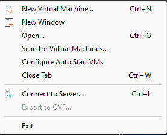

# Setup

1. Use the installation link to download the .ova file.
2. Import the image file to VMware using File -> Open 



> [!WARNING]  
> The images are not supported by virtualbox. 

1. Choose a Virtual Machine name and location for the new VM.
2. The default Network Interface is configured as NAT. If not, please do so.
3. You can find IP address of the machine using arp-scan in your kali machine.
```
┌──(kali㉿kali)-[~]
└─$ sudo arp-scan -l
Interface: eth0, type: EN10MB, MAC: 00:0c:29:f7:91:2b, IPv4: 192.168.163.133
Starting arp-scan 1.10.0 with 256 hosts (https://github.com/royhills/arp-scan)
192.168.163.1   00:50:56:c0:00:08       VMware, Inc.
192.168.163.2   00:50:56:e9:26:ad       VMware, Inc.
192.168.163.135 00:0c:29:15:64:ff       VMware, Inc.
192.168.163.254 00:50:56:fb:dd:06       VMware, Inc.

4 packets received by filter, 0 packets dropped by kernel
Ending arp-scan 1.10.0: 256 hosts scanned in 2.018 seconds (126.86 hosts/sec). 4 responded

┌──(kali㉿kali)-[~]
└─$ ssh root@192.168.163.135
The authenticity of host '192.168.163.135 (192.168.163.135)' can't be established.
ED25519 key fingerprint is SHA256:FgEM7djbdkf6qtvyLOr4TPV35vMzjmXSJ09Cm8VHB8k.
This key is not known by any other names.
Are you sure you want to continue connecting (yes/no/[fingerprint])? yes
Warning: Permanently added '192.168.163.135' (ED25519) to the list of known hosts.
root@192.168.163.135's password: 
Permission denied, please try again.
root@192.168.163.135's password: 
Permission denied, please try again.
root@192.168.163.135's password: 
Welcome to Ubuntu 22.04.3 LTS (GNU/Linux 6.2.0-33-generic x86_64)

 * Documentation:  https://help.ubuntu.com
 * Management:     https://landscape.canonical.com
 * Support:        https://ubuntu.com/advantage

Expanded Security Maintenance for Applications is not enabled.

28 updates can be applied immediately.
27 of these updates are standard security updates.
To see these additional updates run: apt list --upgradable

Enable ESM Apps to receive additional future security updates.
See https://ubuntu.com/esm or run: sudo pro status

Last login: Thu Sep 14 21:15:45 2023 from 10.1.3.1
root@bytescribe-virtual-machine:~# 

```
7. If something goes wrong, use the credentials provided below to access the machine.

# Credentials
```
root:qpWO10@(
```
