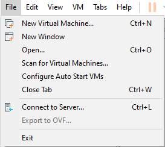

# Setup

1. Use the installation link to download the .ova file.
2. Import the image file to VMware using File -> Open 



> [!WARNING]  
> The images are not supported by virtualbox. 

3. Choose a Virtual Machine name and location for the new VM.
4. The default Network Interface is configured as NAT. If not, please do so.
5. You can find IP address of the machine using arp-scan in your kali machine.
```
┌──(kali㉿kali)-[~]
└─$ sudo arp-scan -l        
Interface: eth0, type: EN10MB, MAC: 00:0c:29:2e:e5:cf, IPv4: 192.168.121.128
Starting arp-scan 1.9.8 with 256 hosts (https://github.com/royhills/arp-scan)
192.168.121.1   00:50:56:c0:00:08       VMware, Inc.
192.168.121.2   00:50:56:f2:3b:82       VMware, Inc.
192.168.121.129 00:0c:29:c7:d8:5e       VMware, Inc.
192.168.121.254 00:50:56:e4:f5:4c       VMware, Inc.

4 packets received by filter, 0 packets dropped by kernel
Ending arp-scan 1.9.8: 256 hosts scanned in 2.050 seconds (124.88 hosts/sec). 4 responded

┌──(kali㉿kali)-[~]
└─$ ssh root@192.168.121.129
root@192.168.121.129's password: 
Welcome to Ubuntu 18.04.4 LTS (GNU/Linux 5.3.0-53-generic x86_64)

 * Documentation:  https://help.ubuntu.com
 * Management:     https://landscape.canonical.com
 * Support:        https://ubuntu.com/advantage

 * Strictly confined Kubernetes makes edge and IoT secure. Learn how MicroK8s
   just raised the bar for easy, resilient and secure K8s cluster deployment.

   https://ubuntu.com/engage/secure-kubernetes-at-the-edge

 * Canonical Livepatch is available for installation.
   - Reduce system reboots and improve kernel security. Activate at:
     https://ubuntu.com/livepatch

74 packages can be updated.
28 updates are security updates.

New release '20.04.6 LTS' available.
Run 'do-release-upgrade' to upgrade to it.

Your Hardware Enablement Stack (HWE) is supported until April 2023.
Last login: Fri Oct  6 04:20:37 2023 from 192.168.121.128
root@shimishao:~# 
```


7. If something goes wrong, use the credentials provided below to access the machine.

# Credentials
```
root:Zold3kMnsn@M1n3
```
